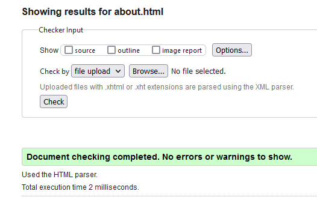
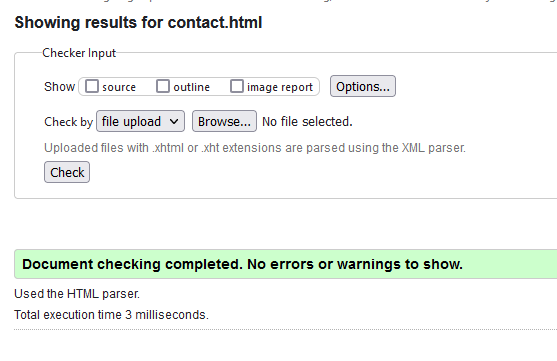
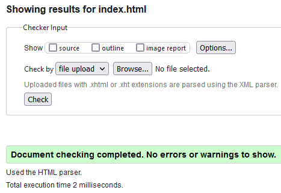
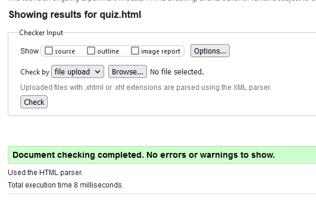
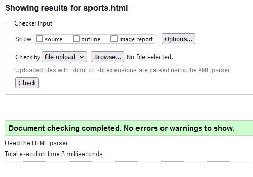
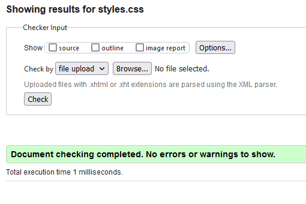

# C3 : Product

This is our sports website that utilizes javascript, html, css

## 3.1 Instalation

```
git clone https://github.com/andreleitee/-inf23tig14.git

cd inf23tig14
```

## 3.2 Usage

Our website can not send any support messages because we are not using any Php language


## 3.3 Forms

We have a validation user input on form Contacto. The name and the email can not be in blank and the email needs to be a email (needs to have the "@")

## 3.4 HTML5 and CSS3 validation

 
 
 
 
 
 

## 3.5 Implementation details


HTML Minimum requirements (usage of)
| Requirement | Usage Example |
| :---: | :---: |
| Table | https://github.com/andreleitee/-inf23tig14/blob/main/src/sports.html#L32 |
| List | https://github.com/andreleitee/-inf23tig14/blob/main/src/sports.html#L25 |
| Image |   [https://github.com/exemploTrabalho/report_inf-ti/blob/aa7b883c6c0da01d3480c941f7bbdcaa1adf0f12/src/index.html#L11](https://github.com/andreleitee/-inf23tig14/blob/main/src/sports.html#L34)    |
| Internal Link | https://github.com/andreleitee/-inf23tig14/blob/main/src/sports.html#L32 |
| Form | https://github.com/andreleitee/-inf23tig14/blob/main/src/contact.html#L25 |

CSS Minimum requirements (usage of/change of)
| Requirement | Usage Example |
| :---: | :---: |
| Type selector | https://github.com/andreleitee/-inf23tig14/blob/main/src/styles.css#L1 |
| Class Selector | https://github.com/andreleitee/-inf23tig14/blob/main/src/styles.css#L7 |
| Text style | https://github.com/andreleitee/-inf23tig14/blob/main/src/styles.css#L15 |
| Font style | https://github.com/andreleitee/-inf23tig14/blob/main/src/styles.css#L2 |
| Background style | https://github.com/andreleitee/-inf23tig14/blob/main/src/styles.css#L8 |
| List style | https://github.com/andreleitee/-inf23tig14/blob/main/src/styles.css#L20 |
| table style | https://github.com/andreleitee/-inf23tig14/blob/main/src/styles.css#L83 |

Other Minimum requirements (location)
| Requirement | Usage Example |
| :---: | :---: |
| XML file | https://github.com/andreleitee/-inf23tig14/blob/main/src/sports.xml |
| XSD file |       |


---
[< Previous](c2.md) | [^ Main](../../../) | [Next >](c4.md)
:--- | :---: | ---: 
